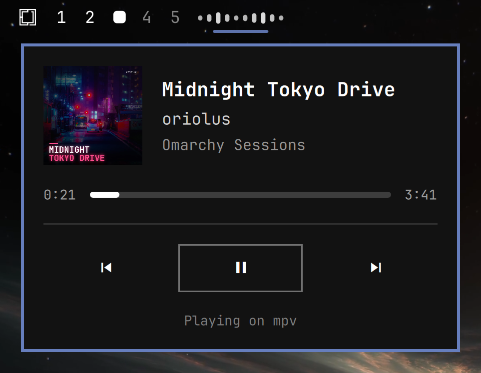

# Audio Visualizer

An **Omarchy** bar widget that draws whatever you are listening to as a row of **spectrum bars**, with **smooth** motion and a **fade in** / **fade out** when playback starts or stops.

[Cava](https://github.com/karlstav/cava) reads the **PipeWire** output and the bars follow it. The widget takes **no space at all** while nothing is playing, and it borrows the bar's own **foreground colour**, so it suits every theme, the transparent bar and vertical bars with no setup.

<div align="center">
    
</div>

## Install

```bash
omarchy pkg add cava
omarchy plugin add https://github.com/oriolescserr/omarchy-audio-visualizer --enable
```

## Use

Anything that speaks MPRIS drives it: Spotify, browsers, mpv, VLC.

| Action           | Result                                                                        |
| ---------------- | ----------------------------------------------------------------------------- |
| **Hover**        | Title over artist, in a bar-native tooltip. Long titles scroll like a ticker. |
| **Left click**   | A card with album art, album, progress and previous / play-pause / next       |
| **Middle click** | Pause                                                                         |

### Keyboard

The card takes the keyboard while it is open:

| Key                  | Action                        |
| -------------------- | ----------------------------- |
| **Space** / **Enter** | Play / pause                  |
| **←** **→** (h l)    | Back / forward 5 seconds      |
| **↑** **↓** (k j)    | Player volume up / down       |
| **N** / **P**        | Next / previous track         |
| **0** - **9**          | Jump to 0 %–90 % of the track |
| **Esc**              | Close                         |

To open it without the mouse, bind a key in `~/.config/hypr/bindings.lua`:

```lua
o.bind("SUPER + ALT + M", "Music Visualizer Card", "omarchy-shell oriolus.audio-visualizer toggle")
```

The same target also takes `open`, `close`, `playPause`, `next`, `previous`, `forward` and `back` (10 seconds), so any of them can have a key of its own.

## Settings

The bar count lives in the widget's entry in `~/.config/omarchy/shell.json`, between **4** and **32**:

```bash
omarchy bar set oriolus.audio-visualizer bars 14
```

## Uninstall

```bash
omarchy plugin remove oriolus.audio-visualizer
```

`cava` stays behind; drop it with `omarchy pkg drop cava` if nothing else uses it.